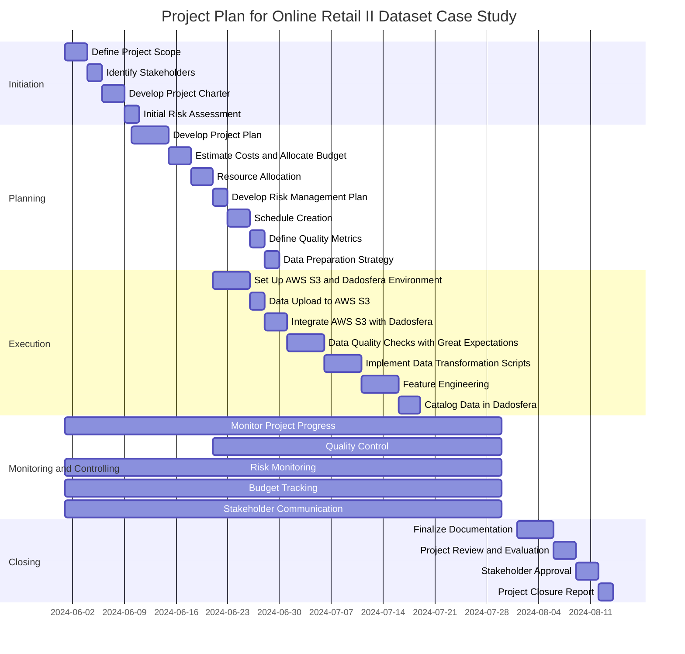

# VITOR_SILVA_DDF_TECH_052024

### Project Overview: Implementation of the Online Retail II Dataset Case Study

#### Project Phases:
1. **Initiation**
2. **Planning**
3. **Execution**
4. **Monitoring and Controlling**
5. **Closing**

### Mermaid Flowchart

Below is a flowchart representation of the project phases using Mermaid. This chart outlines the key steps, dependencies, and critical points of the project.

```mermaid
graph TD
    A[Initiation] --> B[Planning]
    B --> C[Execution]
    C --> D[Monitoring and Controlling]
    D --> E[Closing]

    subgraph Initiation
        A1[Define Project Scope]
        A2[Identify Stakeholders]
        A3[Develop Project Charter]
        A4[Initial Risk Assessment]
        A1 --> A2 --> A3 --> A4
    end

    subgraph Planning
        B1[Develop Project Plan]
        B2[Estimate Costs and Allocate Budget]
        B3[Resource Allocation]
        B4[Develop Risk Management Plan]
        B5[Schedule Creation]
        B6[Define Quality Metrics]
        B7[Data Preparation Strategy]
        B1 --> B2 --> B3 --> B4 --> B5 --> B6 --> B7
    end

    subgraph Execution
        C1[Set Up AWS S3 and Dadosfera Environment]
        C2[Data Upload to AWS S3]
        C3[Integrate AWS S3 with Dadosfera]
        C4[Data Quality Checks with Great Expectations]
        C5[Implement Data Transformation Scripts]
        C6[Feature Engineering]
        C7[Catalog Data in Dadosfera]
        C1 --> C2 --> C3 --> C4 --> C5 --> C6 --> C7
    end

    subgraph Monitoring and Controlling
        D1[Monitor Project Progress]
        D2[Quality Control]
        D3[Risk Monitoring]
        D4[Budget Tracking]
        D5[Stakeholder Communication]
        D1 --> D2 --> D3 --> D4 --> D5
    end

    subgraph Closing
        E1[Finalize Documentation]
        E2[Project Review and Evaluation]
        E3[Stakeholder Approval]
        E4[Project Closure Report]
        E1 --> E2 --> E3 --> E4
    end

    style A fill:#f96,stroke:#333,stroke-width:2px;
    style B fill:#69f,stroke:#333,stroke-width:2px;
    style C fill:#9f6,stroke:#333,stroke-width:2px;
    style D fill:#ff6,stroke:#333,stroke-width:2px;
    style E fill:#f96,stroke:#333,stroke-width:2px;
```

### Task Checklist

**Initiation:**
- [x] Define Project Scope
- [x] Identify Stakeholders
- [x] Develop Project Charter
- [x] Initial Risk Assessment

**Planning:**
- [x] Develop Project Plan
- [x] Estimate Costs and Allocate Budget
- [x] Resource Allocation
- [x] Develop Risk Management Plan
- [x] Create Project Schedule
- [x] Define Quality Metrics
- [x] Prepare Data Preparation Strategy

**Execution:**
- [x] Set Up AWS S3 and Dadosfera Environment
- [x] Upload Data to AWS S3
- [x] Integrate AWS S3 with Dadosfera
- [x] Conduct Data Quality Checks with Great Expectations
- [x] Implement Data Transformation Scripts
- [x] Perform Feature Engineering
- [x] Catalog Data in Dadosfera

**Monitoring and Controlling:**
- [x] Monitor Project Progress
- [x] Control Quality
- [x] Monitor Risks
- [x] Track Budget
- [x] Communicate with Stakeholders

**Closing:**
- [x] Finalize Documentation
- [x] Conduct Project Review and Evaluation
- [x] Obtain Stakeholder Approval
- [x] Prepare Project Closure Report

### Risk Analysis

| Risk Description                           | Probability | Impact | Mitigation Strategy                                        |
|--------------------------------------------|-------------|--------|-------------------------------------------------------------|
| Data Upload Issues                         | Medium      | High   | Ensure stable internet connection and backup the dataset.    |
| Integration Failures                       | Low         | High   | Test integration in a sandbox environment before production. |
| Incomplete or Inaccurate Data              | High        | High   | Conduct thorough data quality checks using Great Expectations.|
| Budget Overruns                            | Medium      | Medium | Regular budget tracking and reallocation as necessary.       |
| Resource Unavailability                    | Low         | Medium | Identify backup resources and cross-train team members.      |
| Stakeholder Miscommunication               | Medium      | High   | Regular updates and clear communication channels.            |
| Technical Issues with Dadosfera Platform   | Low         | High   | Maintain contact with Dadosfera support and have contingency plans.|

### Cost Estimation and Resource Allocation

**Costs:**
- **AWS S3 Storage:** R$100
- **Dadosfera Subscription:** R$249
- **Development Resources (1 Developers, 1 months):** R$3,000
- **Project Management:** R$5,000
- **Miscellaneous Expenses:** R$1,000
- **Total Estimated Cost:** R$9,349

**Resources:**
- **Project Manager:** 1 FTE
- **Data Engineers:** 2 FTEs
- **QA Engineers:** 1 FTE
- **Data Analysts:** 1 FTE

### Gantt Chart

## Online Retail II Dataset

### Dataset Overview

#### Source
The Online Retail II dataset is publicly available and can be obtained from the UCI Machine Learning Repository or other similar repositories.

#### Description
- **Period Covered:** December 1, 2009, to December 9, 2011
- **Company Type:** UK-based online retail specializing in unique gift-ware
- **Customer Base:** Includes both retail customers and wholesalers
- **Number of Records:** Approximately 500,000 transactions

#### Key Columns
- **InvoiceNo:** Unique identifier for each transaction
- **StockCode:** Unique product code
- **Description:** Product description
- **Quantity:** Number of items purchased
- **InvoiceDate:** Date of the transaction
- **UnitPrice:** Price per unit of the product
- **CustomerID:** Unique identifier for each customer
- **Country:** Country of the customer

## Integrating and Loading Data from AWS S3 to Dadosfera

To integrate and load the Online Retail II dataset from AWS S3 into Dadosfera, I followed these steps:

### Step 1: Prepare the Dataset

Converted the dataset from XLSX to CSV format using a script.

### Step 2: Upload the Dataset to AWS S3

1. **Logged In to AWS Management Console:** Accessed the AWS Management Console and logged in with my credentials.
2. **Created an S3 Bucket:** Created a new S3 bucket.
3. **Uploaded the CSV File:**
   - Selected the bucket where I wanted to upload the data.
   - Clicked "Upload" and selected `online_retail_II.csv` from my local storage.
   - Followed the prompts to upload the file to the S3 bucket.

### Step 3: Configure Dadosfera to Connect to AWS S3

1. **Logged In to Dadosfera:** Accessed my Dadosfera account and logged in.
2. **Navigated to Data Ingestion Module:** Found and opened the data ingestion module on the Dadosfera platform.
3. **Created a New Dataset Project:**
   - Went to the data ingestion section.
   - Clicked on "Create New Dataset" or a similar option to start a new data project.

### Step 4: Connect to AWS S3

1. **Add S3 Connection:**
   - In the new dataset project, selected the option to add a data source.
   - Chose AWS S3 as the data source.
2. **Configure S3 Connection Details:**
   - Entered the necessary connection details, including my AWS Access Key, Secret Key, and the S3 bucket name where the dataset is stored.
   - Specified the path to the CSV file (e.g., `online_retail_II.csv`).

### Step 5: Load the Data into Dadosfera

1. **Schema Definition:**
   - Defined the schema based on the dataset columns:
     - `InvoiceNo` (String)
     - `StockCode` (String)
     - `Description` (String)
     - `Quantity` (Integer)
     - `InvoiceDate` (Date)
     - `UnitPrice` (Float)
     - `CustomerID` (String)
     - `Country` (String)

2. **Data Validation:**
   - Validated the dataset to ensure there were no errors or missing values.
   - Utilized Dadosfera's tools to automatically validate data types and formats.

3. **Initiate Data Load:**
   - Once the schema was defined and the data was validated, proceeded to load the data from AWS S3 into Dadosfera.
   - Monitored the loading process to ensure all records were successfully ingested.

4. **Verify the Data Load:**
   - After the data load was complete, verified the number of records loaded into Dadosfera.
   - Ensured that the dataset contained at least 100,000 records.

## Data Loading and Cataloging

### Data Cataloging

I used a script called `to_catalog_dataset.py` to send the most relevant dataset information via the Dadosfera API. This script automates the data cataloging process following best practices for data dictionary management.

#### Structure of the Script `to_catalog_dataset.py`

1. **Importing Libraries:**
   - Imported the `requests` library to make HTTP requests.

2. **API Credentials Configuration:**
   - Set the API credentials (`api_key` and `db_id`), which are passed as command-line arguments.

3. **Defining Dataset Information:**
   - Contained all relevant information, including name, description, and tags.

4. **Function to Catalog the Dataset:**
   - Defined a function that sends a POST request to the Dadosfera API with the dataset information.

5. **Script Execution:**
   - Executed the function to catalog the dataset.

## Data Quality Report using Great Expectations

### Data Quality Check Script with Great Expectations and AWS S3 Integration

I developed a custom script called `to_check_data_quality` that directly connects to our AWS S3 bucket using Great Expectations. This script streamlines the process of validating our data quality against predefined expectations. Here's an overview of how it works:

#### 1. Establishing Connection with AWS S3 Bucket

The script initiates a connection with our AWS S3 bucket, allowing seamless access to the data stored within. This connection is essential for retrieving the data that we want to assess for quality.

#### 2. Configuring Great Expectations

Once connected to the S3 bucket, the script configures Great Expectations to define expectations and validate our data. We specify the expectations that our data must meet, such as checking for null values, data types, or value ranges.

#### 3. Running Data Quality Checks

The script executes data quality checks using Great Expectations directly on the data stored in the S3 bucket. It validates the data against the defined expectations to ensure its integrity and reliability.

#### 4. Generating Validation Reports

After running the data quality checks, the script generates comprehensive validation reports. These reports provide insights into any discrepancies or issues found during the validation process, enabling us to identify and address data quality concerns promptly.

### Addressing Missing Values

Given that there are approximately 2,928 unique descriptions in the transaction dataset, with a total of 4,681 distinct values observed across more than 500,000 instances, it is advisable to address any null values in a strategic manner. One effective practice involves leveraging grouped features and algorithms such as KDD to impute synthetic data for missing values. This approach allows for the generation of meaningful data points based on patterns observed within specific groups or clusters, thereby enhancing the completeness and integrity of the dataset.
